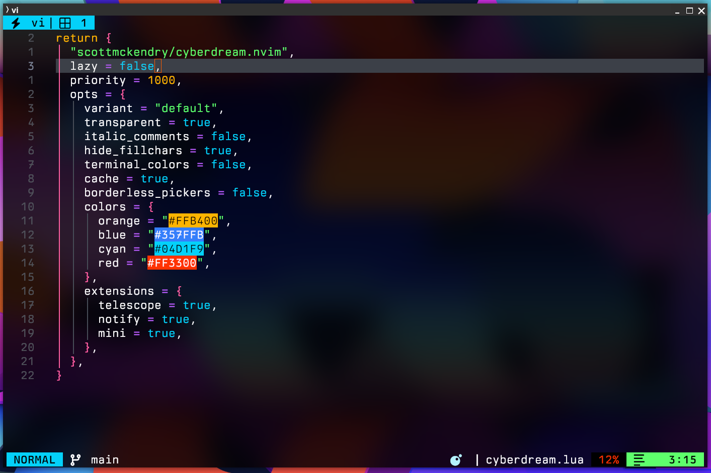
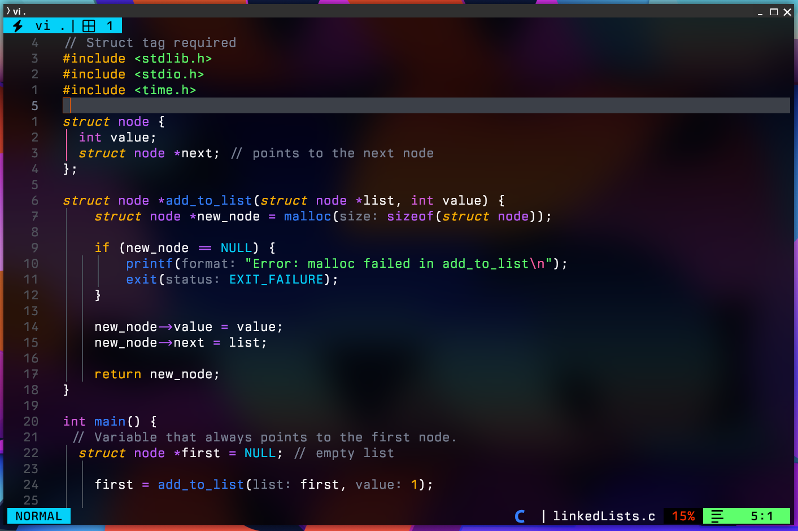
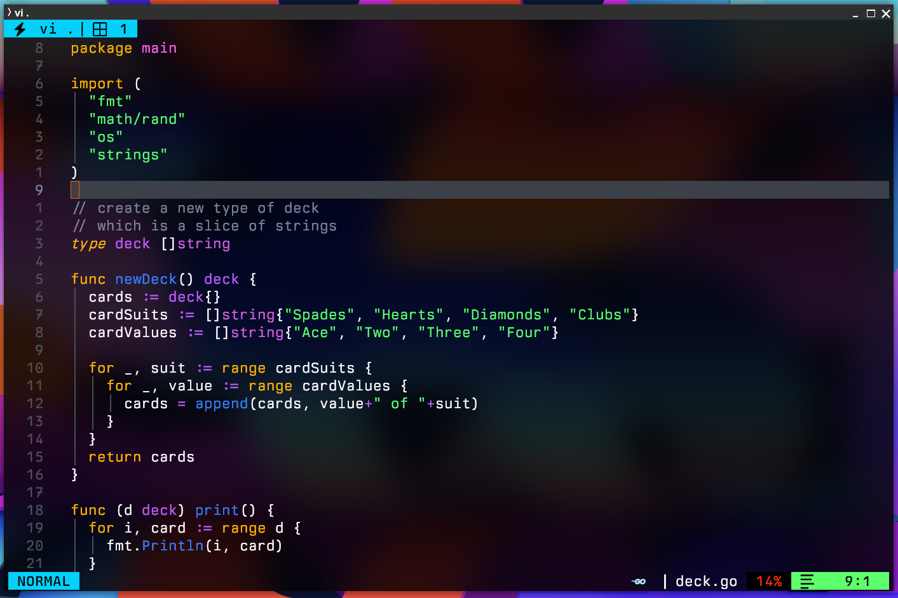
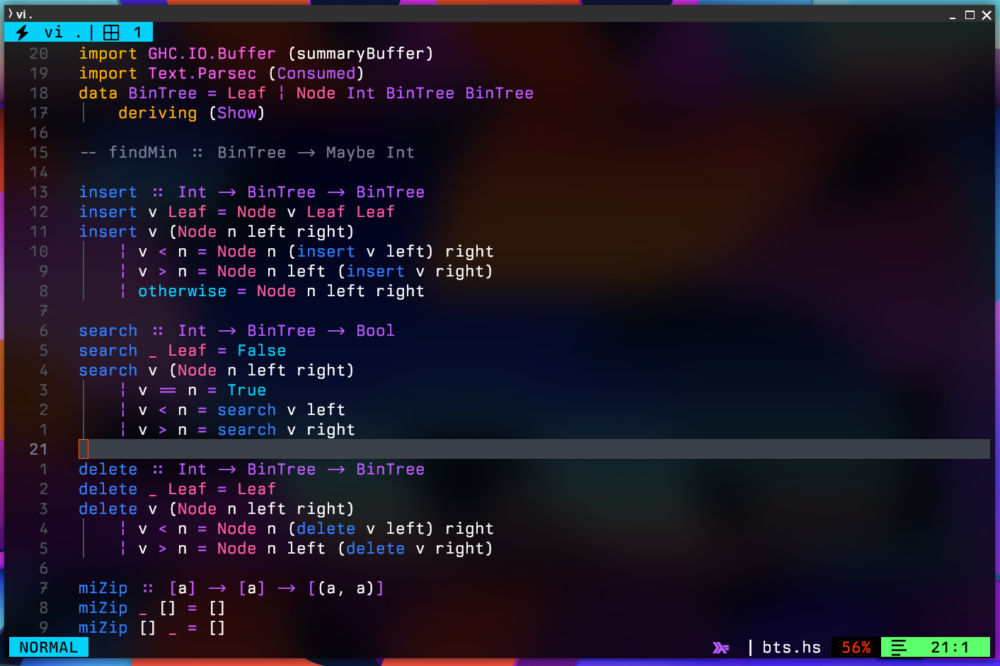

# NVIM dotfiles con LazyVim









## Características de mi configuración

- AI con NeoCodeium.nvim y Supermaven.nvim

- Cyberdream Theme de [scottmckendry](https://github.com/scottmckendry/cyberdream.nvim) con custom colors.
  
  - Toggle para la variante del tema con `<leader>tt`
  
  - Integración con Kitty para cambiar el tema de Cyberdream Dark a Light y al mismo tiempo cambiarlo en Neovim con los shortcuts <kbd>F1</kbd> y <kbd>F2</kbd> (Aclaración: Yo inicio Nvim con el alias `vi` que es la forma en la que Kitty matchea la ventana correspondiente).
    
    Ver este commit: [new: scripts to change kitty and neovim themes](https://github.com/NickmDrummer/dotfiles/commit/243fcb61e865117a9dc01dd2ca19624077b04fcf)
  
  - Colores cambiados:
    
    | Color  | Hex     |
    | ------ | ------- |
    | blue   | #357FFB |
    | orange | #FFB400 |
    | cyan   | #04D1F9 |
    | red    | #FF3300 |

- Plugin de Live Server (opcional)

## ⚡️ LazyVim Requirements

- Neovim >= 0.9.0 (needs to be built with LuaJIT)
- Git >= 2.19.0 (for partial clones support)
- a Nerd Font(v3.0 or greater) (optional, but needed to display some icons)
- lazygit (optional)
- a C compiler for nvim-treesitter
- curl for blink.cmp (completion engine)
- for fzf-lua (optional)
  - fzf: fzf (v0.25.1 or greater)
  - live grep: ripgrep
  - find files: fd
- Node with NPM
- a terminal that support true color and undercurl:
  - kitty (Linux & Macos)
  - wezterm (Linux, Macos & Windows)
  - alacritty (Linux, Macos & Windows)
  - iterm2 (Macos)

## Instalación de requerimientos en Fedora

- Instalar neovim, git, curl, ripgrep, fd, node

```bash
sudo dnf install git curl neovim ripgrep fd-find node
```

- Verificar que GCC esté instalado con `gcc --version` (ya se instala al instalar neovim)

- Instalar live-server y pnpm `npm install -g pnpm live-server` (opcional)

- Descargar una [Nerd Font](https://www.nerdfonts.com/font-downloads)

- Una Terminal que soporte True Color y undercurl. Mi preferencia es [Kitty](https://sw.kovidgoyal.net/kitty/)

- Para dejar el efecto blur con transparencia:
  
  - Blur My Shell (Gnome Linux Extension):
    
    Bajar la opacidad en Kitty en el archivo ~/.config/kitty/kitty.conf
    
    `background_opacity 0.7`
  
  - MacOs:
    
    ```textile
    background_opacity 0.7
    background_blur 60
    ```

## Antes de clonar mi repositorio

Hacemos un backup de la carpeta nvim si existiere:

- Requerido

`mv ~/.config/nvim{,.bak}`

- Opcional pero recomendado

```
mv ~/.local/share/nvim{,.bak}
mv ~/.local/state/nvim{,.bak}
mv ~/.cache/nvim{,.bak}
```

## Clonar mi repositorio en la carpeta ~/.config/nvim

```
git clone https://github.com/NickmDrummer/nvim ~/.config/nvim
```

> [!CAUTION]
> REQUERIDO: Remover la carpeta .git para que después puedas iniciar tu propio repositorio.

```
rm -rf ~/.config/nvim/.git
```

## Iniciar NVIM!

```
nvim
```
